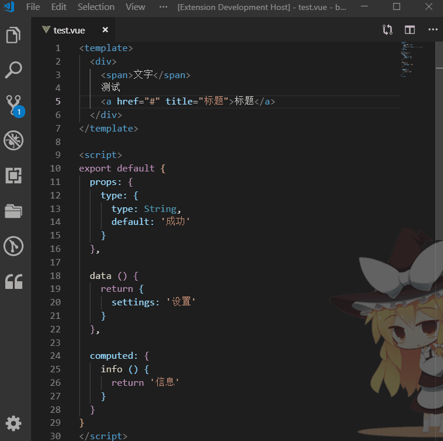

# vue-i18n-helper README

## Features

We provide shortcuts for writing vue-i18n, Select the text and use CTRL +T, You will replace the selected text for formatting.Also if you select the text, use the CTRL + shift + p, call command ` kuaizi / @ $t ` to execute it.

## Release Notes

Users appreciate release notes as you update your extension.

### 0.0.1

Added features `Ctrl+T` to convert `vue-i18n` gammer and command `@kuaizi/$t`.

-----------------------------------------------------------------------------------------------------------

**Enjoy!**
